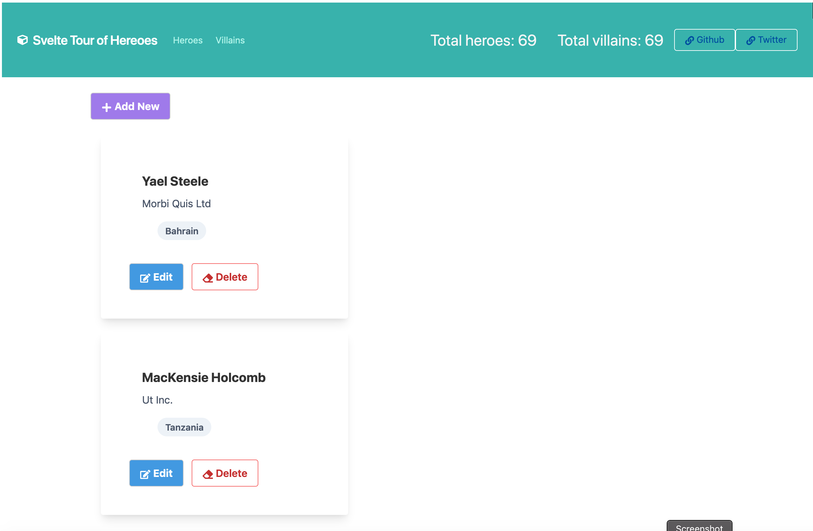

# My version of Tour of Heroes app using Svelte.

### Features
Tailwind, store for state management, HTTP request (using axios), navigation params, 2 stores, computed values.

### To run the project after cloning

Create or go to your demo directory then run the following in the terminal or cmd.

```sh
$ git clone https://github.com/webmasterdevlin/heroes-svelte-tailwind.git
$ cd heroes-svelte-tailwind
$ npm install
$ npm run start
```

The Svelte app and the fake web service will run concurrently.

---



---

## Tailwind.css installation

### Setting up Tailwind with svelte is really simple, just install Tailwind and pocstcss-cli:

```sh
npm install tailwindcss postcss-cli --save-dev
```

If you want to remove unused styles, add PurgeCSS as well

```
npm install @fullhuman/postcss-purgecss
```

Create your Tailwind config file

```sh
./node_modules/.bin/tailwind init tailwind.js
```

Create a `postcss.config.js` file and add this to it

```js
const tailwindcss = require("tailwindcss");

// only needed if you want to purge
const purgecss = require("@fullhuman/postcss-purgecss")({
  content: ["./src/**/*.svelte", "./public/**/*.html"],
  defaultExtractor: content => content.match(/[A-Za-z0-9-_:/]+/g) || []
});

module.exports = {
  plugins: [
    tailwindcss("./tailwind.js"),

    // only needed if you want to purge
    ...(process.env.NODE_ENV === "production" ? [purgecss] : [])
  ]
};
```

Next, create a CSS file for your Tailwind styles. You have to store in it public folder `public/tailwind.css` and add this to it :

```css
@tailwind base;
@tailwind components;
@tailwind utilities;
```

Update your `package.json` with the custom scripts.

`build:tailwind is only needed if you want to purge`

```js
"scripts": {
    "watch:tailwind": "postcss public/tailwind.css -o public/index.css -w",
    "build:tailwind": "NODE_ENV=production postcss public/tailwind.css -o public/index.css",
    "dev": "run-p start:dev autobuild watch:build",
    "build": "npm run build:tailwind && rollup -c",

}
```

Finally, add a stylesheet link to your `public/index.html` file

```html
<link rel="stylesheet" href="index.css" />
```

## Project setup

```
npm install
```

### Compiles and hot-reloads for development

```
npm run dev
```

### Compiles and minifies for production

```
npm run build
```

---

# Svelte README

This is a project template for [Svelte](https://svelte.dev) apps. It lives at https://github.com/sveltejs/template.

To create a new project based on this template using [degit](https://github.com/Rich-Harris/degit):

```bash
npx degit sveltejs/template svelte-app
cd svelte-app
```

*Note that you will need to have [Node.js](https://nodejs.org) installed.*


## Get started

Install the dependencies...

```bash
cd svelte-app
npm install
```

...then start [Rollup](https://rollupjs.org):

```bash
npm run dev
```

Navigate to [localhost:5000](http://localhost:5000). You should see your app running. Edit a component file in `src`, save it, and reload the page to see your changes.


## Deploying to the web

### With [now](https://zeit.co/now)

Install `now` if you haven't already:

```bash
npm install -g now
```

Then, from within your project folder:

```bash
cd public
now
```

As an alternative, use the [Now desktop client](https://zeit.co/download) and simply drag the unzipped project folder to the taskbar icon.

### With [surge](https://surge.sh/)

Install `surge` if you haven't already:

```bash
npm install -g surge
```

Then, from within your project folder:

```bash
npm run build
surge public
```
